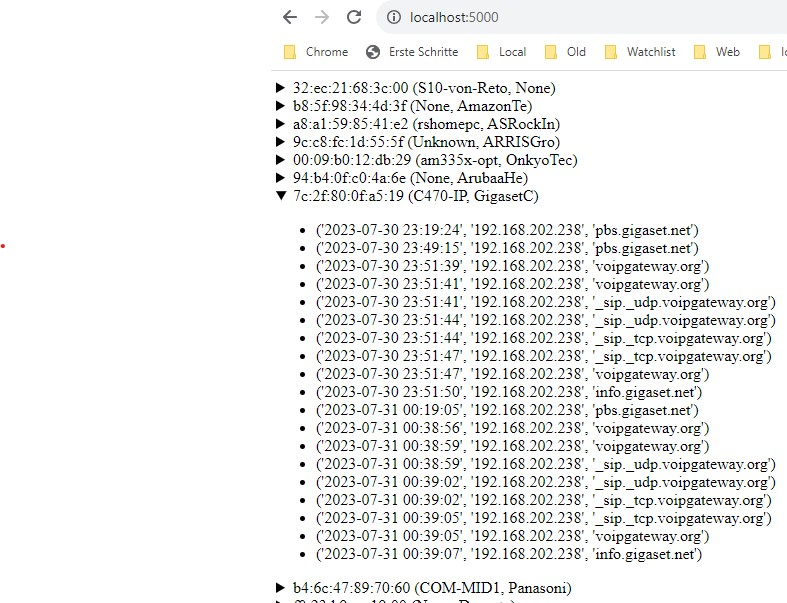

# DNS_Sniffer_2.0
DNS/Host-Name Sniffer with Webinterface 
Use a managed switch with port-mirroring to sniff the internet traffic 
Run the DNS Sniffer with root rights and set the sniffer interface 

